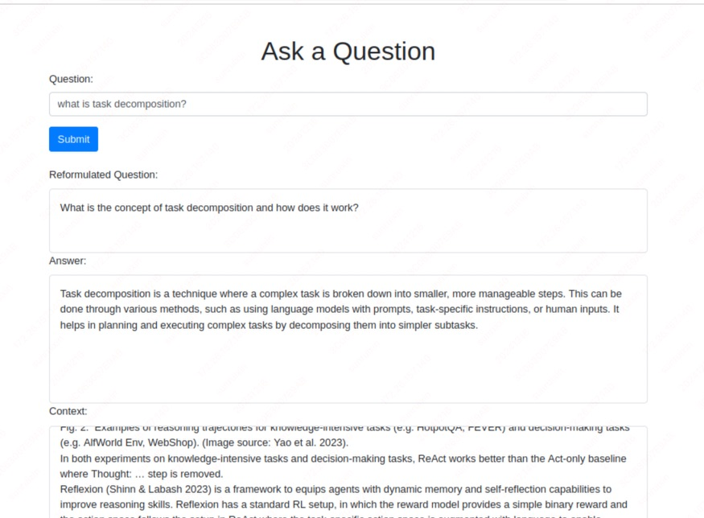

# bamcado

bamcado-chat项目的后端服务，负责处理业务逻辑、数据存储和API接口的提供。采用稳健的后端技术，确保服务的稳定性和可扩展性。

## 阶段性成果展示
### 用langchain和fastapi实现对话


## 介绍

基于 LangChain 应用开发框架集成 GLM4-9B-Chat（或ChatGLM3-6b） 和GLM -4 两种形式的模型，通过 FastAPI 构建 ResfFul API，借助PostMan工具测试 ResfFul API 接口连通性，最终实现通过接口的形式与本地开源大模型 GLM4-9B-Chat（或ChatGLM3-6b） 模型的对话交互。

## 安装

### 前提条件


- Python 3.11

### 安装步骤

1. 私有化启动 Glm4-9B-Chat或者ChatGLM3-6B。
2. 克隆仓库并安装依赖：
    ```bash
    pip install -r requirements.txt
    ```
3. 启动后端服务：
    ```bash
    python server/api_router.py
    ```

## 使用示例

使用 Postman 或其他 HTTP 客户端工具访问 API 接口：

### POST 请求示例

```http
POST http://127.0.0.1:8000/api/chat
Content-Type: application/json
{
    "query":"你好，请你介绍一下你自己",
    "model_name":"chatglm3-6b",
    "temperature":0.8,
    "max_tokens":4096
}
```

